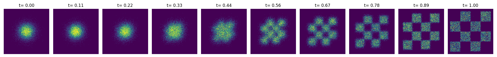

# Multi-GPU Parametric Sweeps on TACC

This guide walks through the steps to launch a parametric sweep for a set of GPU training jobs. By the end of this tutorial, you will know how to setup a container that can run on TACC and have trained a continous flow matching model that transforms samples from a gaussian distribution to a gridlike distribution as follows.



## Prerequisites

- Local Computer with Docker/Podman
- TACC Account + Allocation
- Access to GPU-enabled TACC Server

## Installation (Local)

Before proceeding, ensure that the `$HOME` environment variable is set to your home directory.

### Building Docker Container

1. Clone this github repository to your local computer. 
```bash
cd $HOME
git clone git@github.com:ut-amrl/tacc-tutorial.git
```

2. Build the container for the flow matching tutorial. This should take a few minutes at most.
```bash
cd $HOME/tacc-tutorial/2d_flow_matching
docker build -t 2d_flow_matching .
```

3. If you would like to test the container locally first, you can run the following command. It should take a few minutes to finish converging.

```bash
cd $HOME/tacc-tutorial/2d_flow_matching
./run_docker.sh $HOME/tacc-tutorial
```

4. After the container finishes building, you should upload it docker hub so that we may pull it to use on TACC. Note, the convenience script below assumes that your `$DOCKER_USER` environment variable is set and matches your docker account. If it is not set, make sure to set it before running the script below.

```bash
export DOCKER_USER=artzha
./push_container.sh
```

5. Congratulations! You have finished preparing your docker container to run on TACC. Next, we will show how to launch a parametric sweep on TACC.


## Installation (TACC)

1. Login onto to TACC with your registered account. In the commnad below, we assume that you are using the `lonestar6` TACC server and the `arthurz` account name. You will need to change these depending on your account and server name.
```bash
ssh arthurz@ls6.tacc.utexas.edu
```

2. Clone this repository to the `$SCRATCH` directory. This environment variable is automatically set when you ssh into TACC. Then login to an interactive compute node.
```bash
cd $SCRATCH
git clone git@github.com:ut-amrl/tacc-tutorial.git
idev -m 30 -p vm-small
```

3. Pull and build the singularity sif image. You will need to set the `DOCKER_USER` environment variable to match your docker account that you pushed the container to in step 5 of the local installation step for the script below to work properly. Alternatively, you may also use the default container by copying and pasting the commands below. This will take a few minutes. 
```bash
export DOCKER_USER=artzha
cd $SCRATCH/tacc-tutorial/2d_flow_matching
./pull_apptainer.sh
```

4. Modify the `slurn_sweep.sh` file in the `2d_flow_matching` directory by setting the `#SBATCH -A` value from `MLL` to your allocation. This is user dependent and can be found on the TACC account portal. We provide a code snippet below for context.

```bash
#Job Sweep Settings
...
#SBATCH -N 1         # number of nodes requested
#SBATCH -t 00:15:00  # run time (hh:mm:ss) 
#SBATCH -A MLL       # CHANGE THIS ROW!
...
# Job Launch Settings
```

5. Submit your parametric sweep job request to TACC using the helper script provided.

```bash
sbatch slurn_sweep.sh
```

To monitor the progress of your jobs, you can run the following command to constantly refresh the status of your job. These jobs make take anywhere between a few minutes to a few hours to complete depending on your server's workload.

```bash
./check_jobs.sh
```

6. When the jobs complete, you should see an `outputs` directory be created with three directories containing sample visualizations from each flow matching model that you trained along with the hyperparameters for each. You should also see additional directories created containing the current progress of each job. You should observe that only one of the models converges successfully to our desired distribution.


